# WaitState

### Table of contents

* [Team Members](#team-members)
* [Overview](#overview)
* [User Guide](#user-guide)

# Overview
Meteor-based web application aiming to solve the issue of vague hospital emergency room wait times.  Patients will be able to make informed decisions about which hospital they go to by checking emergency room wait times before hand.

Our deployed website can be found on: [WaitState](https://waitstate.meteorapp.com/)

Our development can be found on: [Github](https://github.com/WaitState/WaitState)

## Team Members
* Jake Imanaka
* Tsz Ching Wong
* Patrick McCrindle
* Clyde James Felix
* Justin Wong

# User Guide
This user guide includes a walkthrough of the application for hospital admins, site admins, and patients.

### Landing Page
Without loggin in, users are able to search for nearby hospital and/or check for patient wait time if given a temporary id.
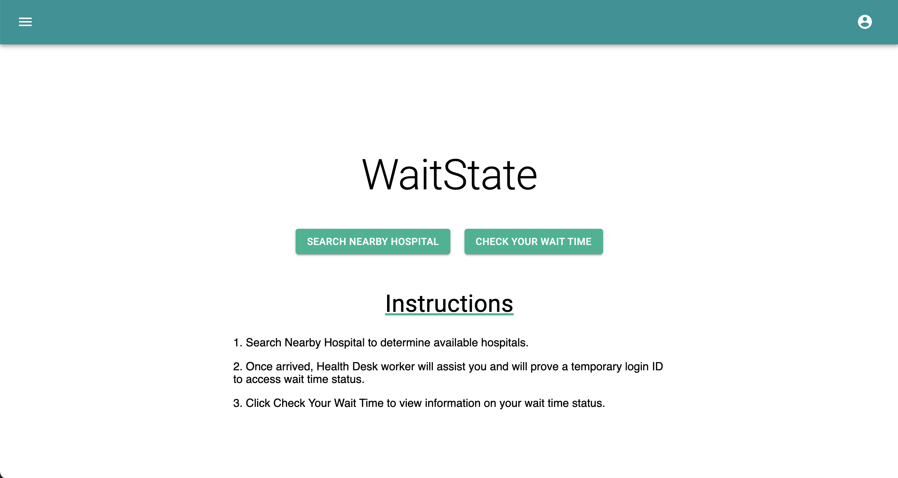

### Hospital Directory Page
After clicking the SEARCH NEARBY HOSPITAL button, users will be able to search by name/address.
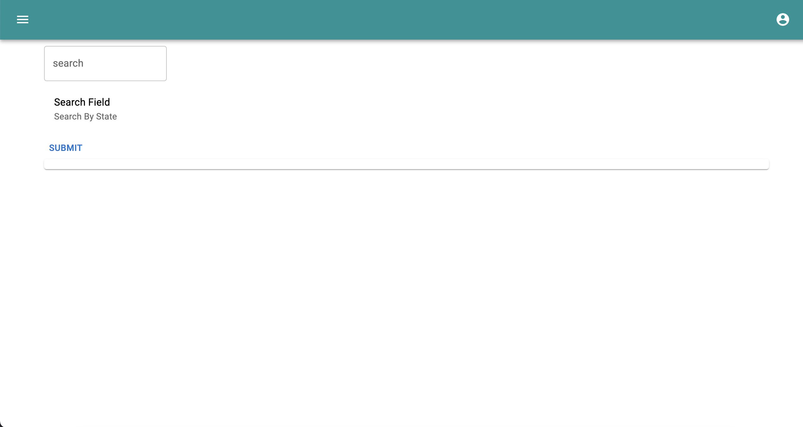

The SUBMIT button will query a list of hospitals.
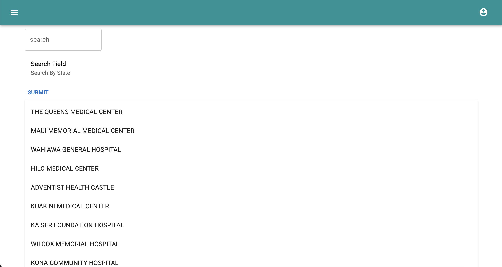

After clicking on a hospital, users can see more info about the hospital such as average wait time and contact number.
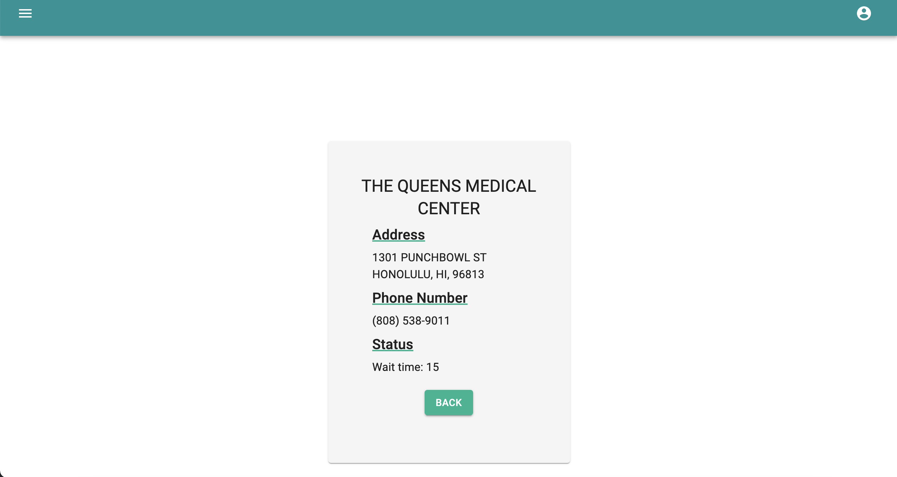

### Admin Login
Site admins and hospital admins will have to login through the ADMIN LOGIN button to access more functionalities.
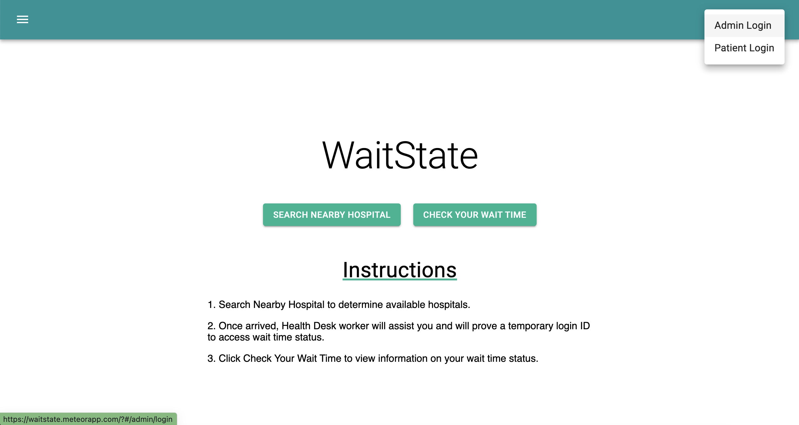

Admins will login with their email and password.
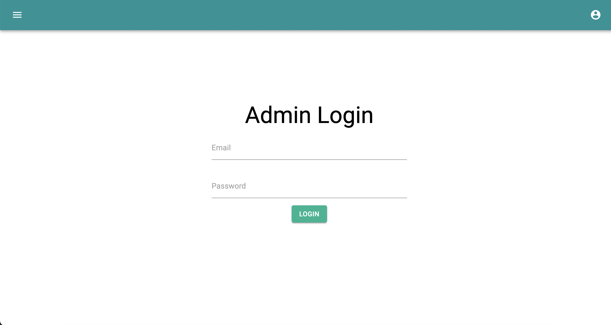

### Site Admin
After logging in as site admin, he/she can add hospital admins with the ADD ADMIN button.
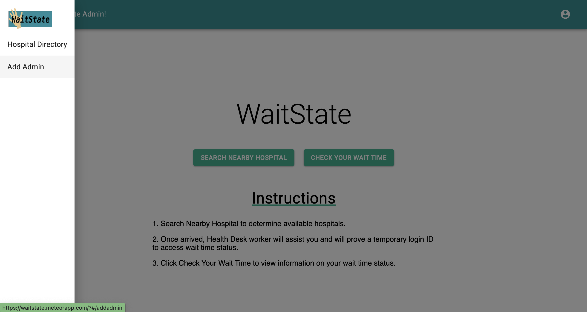

The ADD ADMIN button will link to a form that can be used to add hospital admins.
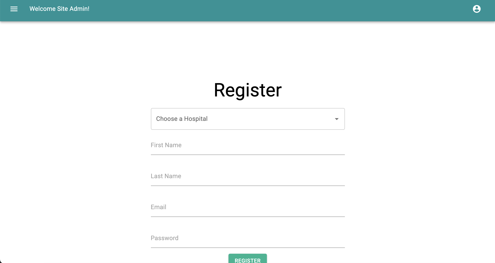

### Hospital Admin
After loggin in as hospital admin, he/she can add patient and generate a temporary id for the patient.
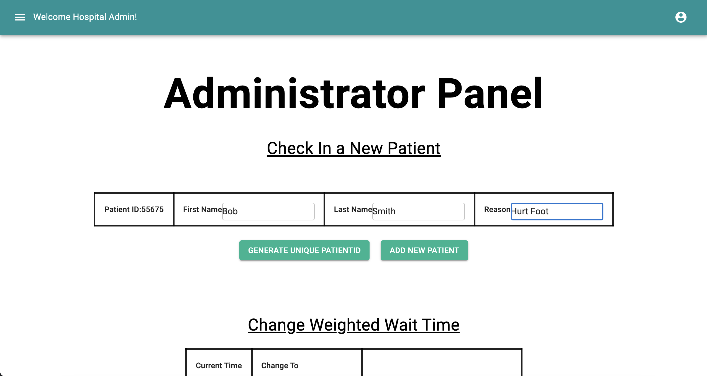

A sweet alert will display a message whether patient is added successfully or not. If added successfully, patient will appear under the List of Current Patients table.
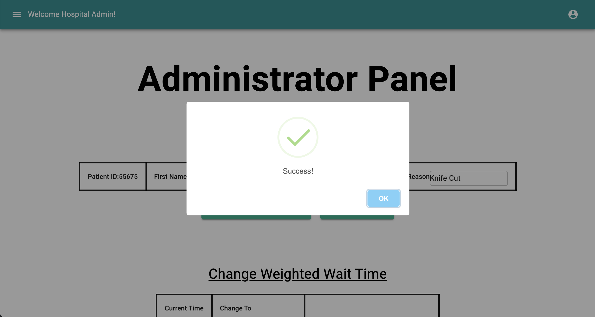

With the CHANGE AVERAGE WAIT TIME button, hospital admin can change the average wait time at any time.
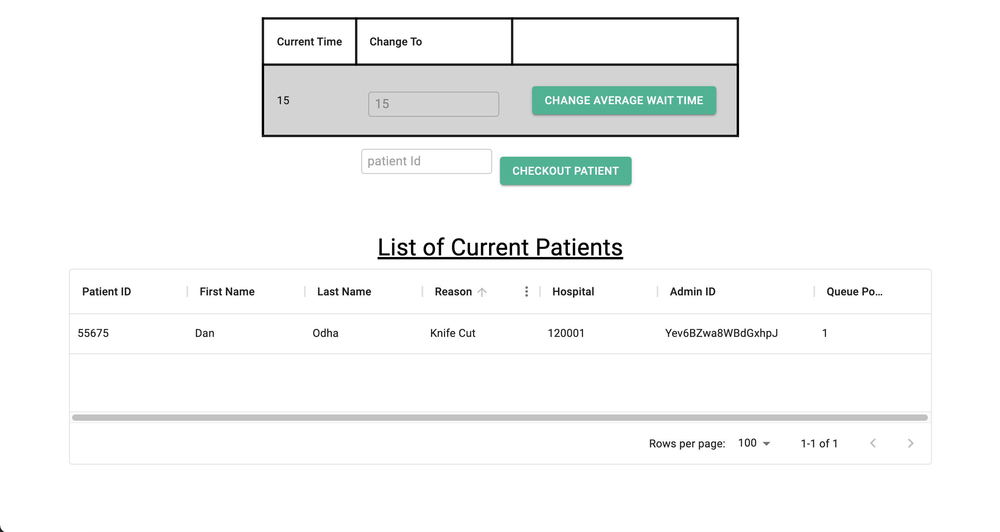

To checkout a patient, simply click the CHECKOUT PATIENT button after entering the patient id.
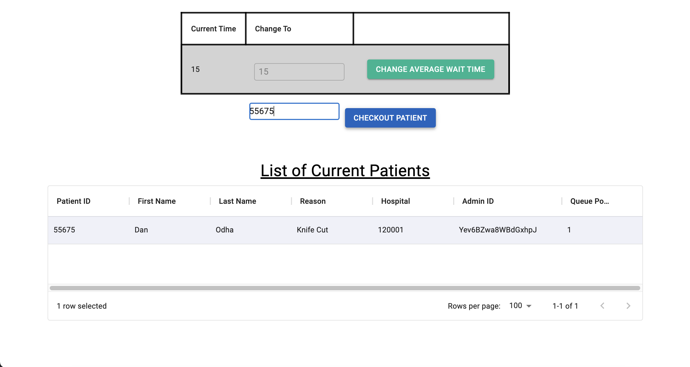

### Patient Login
Patients can view their wait time through patient login and the CHECK YOUR WAIT TIME button.
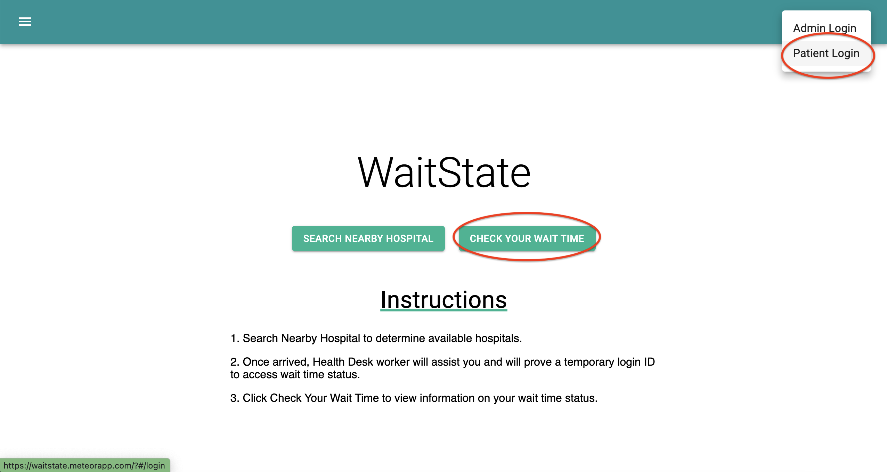

Patients will have to enter their patient id to acess their wait time.
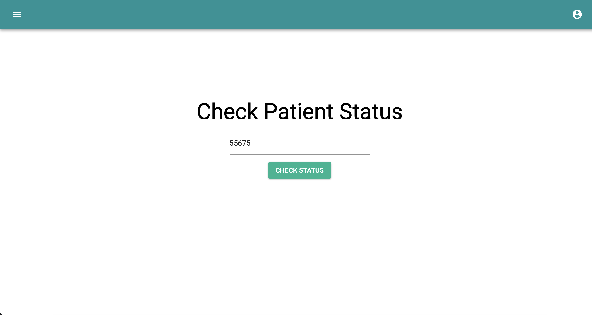

After entering the patient id, patients can view their estimated wait time and check-in time.
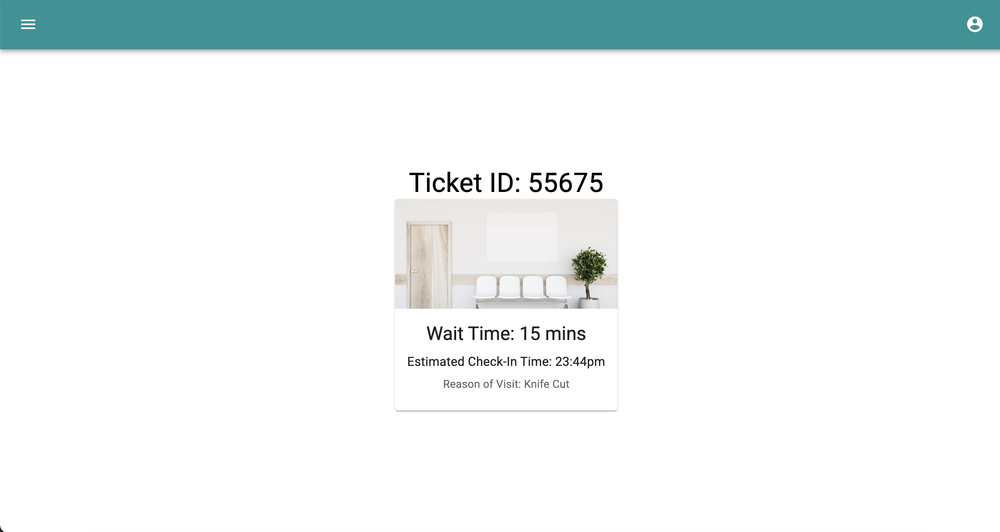

